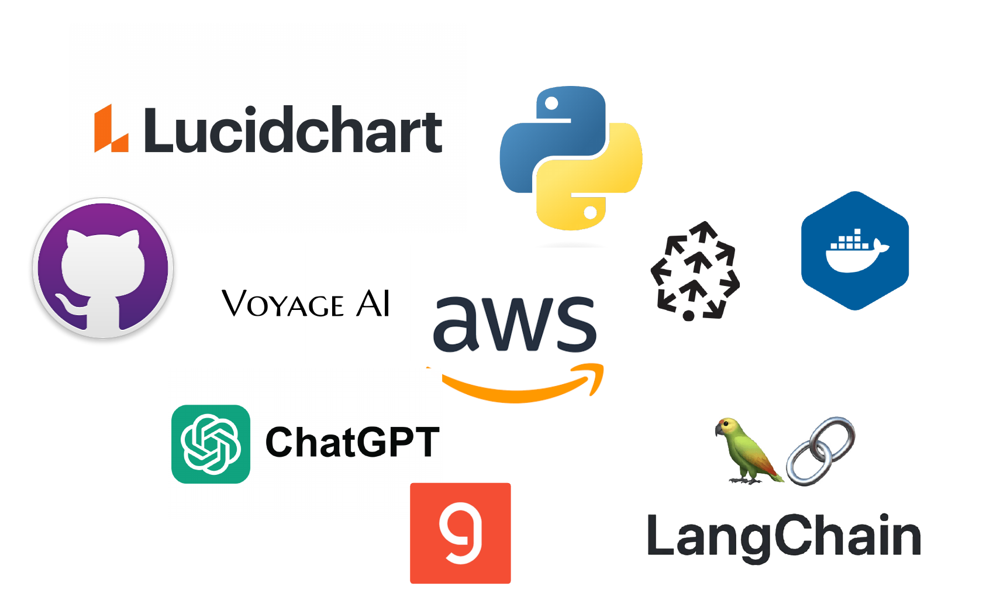

# AI Chatbot in Patients Education

___Creating a RAG-powered chatbot to make good patient education more accessible, and to improve the outcomes of patients & doctors.___

## The problem & business

Patient education refers to the process of providing health-related information and instructions to patients to help them manage their health conditions and make informed decisions about their care. It aims to improve patients' understanding of their medical conditions, treatment options, and self-care practices, thereby promoting better health outcomes and enhancing the overall healthcare experience.

Effective patient education can lead to better adherence to treatment plans, improved self-management of chronic conditions, reduced hospital readmissions, and overall enhanced patient satisfaction and health outcomes.

__Crazy stat: By saving 10% of the doctor's time, we could potentially save time for an additional 1B patient visits*__

## Main tools

- AWS: S3, Lambda, SNS, CloudWatch, CLI
- Github
- Docker
- Lucidchart
- LLM ToolKit(ChatGPT API, LangChain)
- Groq API
- Voyage AI
- Pinecone
- NLTK
- More APIs

## Workflow V2.0

## TimeLine
- Week 1 & 2: Design stage
- Week 3: Data Collection
- Week 4: LLM
- Week 5: RAG & VectorDB
- Week 6: Frontend
- week 7&8: Dev & Demo

## Cost Analysis
We control the cost for most APIs under the free tier or $10 US dollars for each. For the cloud service we use in this project, we tentatively set the budgets around $20 US dollars for each. It is each to scale due to the pay-as-you-use nature of the cloud.

## Milestone and Technical Details (Continuing)

### User Info Desensitization
By utizling Lambda functions with python NLTK packages to omit users sensitive infomation and then store them into the AWS S3 buckets, which results the following benefits:
- Privacy Protection
- Compliance with Regulations
- Data Security
- Facilitating Data Sharing
- Building Trust
- Reducing Liability
- Enabling Innovcation
Note that NLTK package is not supported by AWS lambda directly. We need a Lambda layer to achieve this goal, and a corresponding lambda layer can be created by Docker(see code).

### Data Collection and Uploading
Collecting data from various reliable external data sources, then either store them local or upload to S3 buckets directly via REST API. If one chooses the former method, the following method can be either using Python boto3 for single file or a two-line AWS CLI command to upload all files in the target folder recursively.

### Data Preprocessing
As the vital process in the whole data pipeline, we need preprocess data from all sources. Similar to the User info desensitization step, we use a lambda function with a corresponding layer to achieve.

As a remainder, a data preprocessing is mandatory since it improves data quality, enhances model performance, reduces complexity, handles missing values, prevents data leakage, facilitates better feature engineering, ensures consistency, enhances interpretability, supports data integration and enables effective sampling.

### Data Ingestion
The following step right after preprocessing is vector embedding and chunking, which supports the queries from the users/applications.

In this step, we use lambda function along with a layer that contains the Voyage AI and Pinecone APIs. We use the later two ApIs achieving the vector embedding and chunking goals.

### LLM APIs
For this milestone, we use various APIs to build a very basic chatbot. APIs include ChatGPT API, Assistant API, Whicper API, Groq API and Audio API.

More than that, to enhance the overall performance, we utlize the LangChain framework to solve the limitations and provide basic components and connections.

### Frontend
This project showcases an interactive chatbot developed using Streamlit for the frontend and enhanced with custom CSS for a polished and user-friendly interface. The chatbot is designed to provide seamless interactions, leveraging the capabilities of Streamlit to create a dynamic and responsive user experience.

### User Input Extraction
Extract keywords from user input(desensitized) and then feed those data to data analysis and sencise team to either enrich the database or train the model.