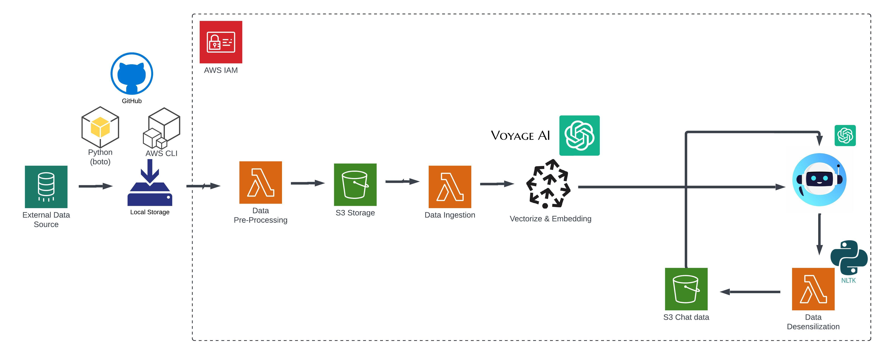

# AI Chatbot in Patients Education

___Creating a RAG-powered chatbot to make good patient education more accessible, and to improve the outcomes of patients & doctors.___

## The problem & business

Patient education refers to the process of providing health-related information and instructions to patients to help them manage their health conditions and make informed decisions about their care. It aims to improve patients' understanding of their medical conditions, treatment options, and self-care practices, thereby promoting better health outcomes and enhancing the overall healthcare experience.

Effective patient education can lead to better adherence to treatment plans, improved self-management of chronic conditions, reduced hospital readmissions, and overall enhanced patient satisfaction and health outcomes.

__Crazy stat: By saving 10% of the doctor's time, we could potentially save time for an additional 1B patient visits*__

## Main tools

- AWS: S3, Lambda, SNS, CloudWatch, CLI
- Github
- Docker
- Lucidchart
- LLM ToolKit(ChatGPT API, LangChain)
- Groq API
- Voyage AI
- Pinecone
- NLTK
- More APIs

## Workflow

## TimeLine
- Week 1 & 2: Design stage
- Week 3: Data Collection
- Week 4: LLM
- Week 5: RAG & VectorDB
- Week 6: Frontend
- week 7&8: Dev & Demo